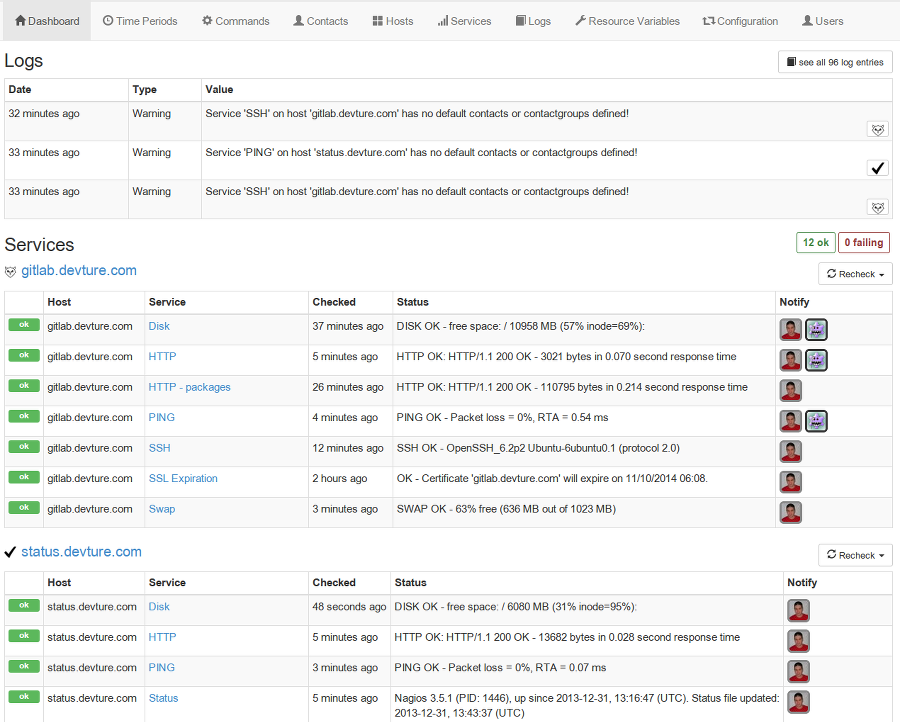

<h1 align="center">Nagadmin</h1>

<p align="center">
	<b>An all-in-one <a href="https://www.nagios.com">Nagios</a> monitoring stack</b> — a beautiful web UI to
	<i>configure</i> Nagios and <i>watch</i> your services, with <b>Nagios itself built right in</b>.
</p>

<p align="center">
	<a href="LICENSE"></a>
	
	
	
	
</p>

Editing Nagios `.cfg` files by hand is tedious, needs terminal access, and gives you no real overview of what's
configured. **Nagadmin** replaces that with a friendly, mobile-friendly web interface — and, unlike most
configurators, it doesn't expect you to bring your own Nagios. The Nagios engine is **bundled and managed for you**,
so a single command brings up a complete, self-hosted monitoring system.

It deliberately **optimizes for the common monitoring use-case** rather than supporting every esoteric Nagios
feature. That keeps the workflow simple — but if your needs are very advanced, you may prefer another solution or a
fork. See [🚧 Limitations](#-limitations).

<p align="center">
	
</p>


## 🧩 One stack, batteries included

Nagadmin isn't a configurator that talks to a Nagios you have to install and babysit yourself — **it ships Nagios
too**. A single `just run` brings the whole monitoring stack up in containers:

- 🖥️ **Nagadmin web UI** — the configurator *and* the status frontend (a [Symfony](https://symfony.com/) app under `app/`)
- 📟 **Nagios** — the monitoring engine itself, pre-wired and validated for you
- 🗄️ **MongoDB** — stores your configuration
- 🌐 **nginx** — serves the web UI
- ✉️ **exim mail relay** — delivers notifications, with a persistent retry spool (production)

You configure everything through the web UI; Nagadmin **generates and deploys validated Nagios configuration** for
you. No hand-editing `.cfg` files, no separate Nagios install to wire up.


## 🌟 Why Nagadmin?

- ✅ **Easier than SSHing in to edit raw config** — point-and-click instead of `vi nagios.cfg`
- 🎨 **A pleasant, modern UI** that also works on mobile devices
- 🔄 **Configurator and frontend in one** — set things up *and* watch their status from the same place
- 📦 **Nagios included** — no separate installation; it's part of the stack
- 🔐 **Advanced access control** — many users can see and do different things
- 🎯 **Optimized for the common case** — complex Nagios features are hidden to keep the workflow simple
- 👀 **A clear overview** of both your current configuration and live status


## 🚀 Getting started

### Prerequisites

- [Docker](https://www.docker.com/)
- Docker Compose (v1 or v2)
- [just](https://github.com/casey/just) (command runner)

### 1. Get the code

```sh
cd /srv/http
git clone <repository url> nagadmin
cd nagadmin
```

### 2. Configure

Nagadmin keeps its configuration in two files, each read natively by the tool that needs it:

```sh
cp .env.dist .env          # infrastructure: timezone, published ports, Nagios UI credentials
cp app/.env.dist app/.env  # the Symfony app: secrets, mailer DSN, SMS credentials, etc.
```

Edit both to taste. `app/.env` holds deployment-specific values and secrets such as the notification API secret
(`NAGADMIN_NOTIFICATION_API_SECRET`), the mailer DSN (`MAILER_DSN`) and the Vonage SMS credentials.

### 3. First run

```sh
just run
```

`just run` starts the **development** environment, which includes a
[mailcrab](https://github.com/tweedegolf/mailcrab) mail-catcher so it never sends real e-mail — captured messages are
viewable at http://127.0.0.1:20182. To run the **production** environment instead, use `just run prod`
(see **Running in production** below).

> ℹ️ Nagios won't be fully healthy yet — it can't find its configuration until the install step below.

### 4. Initialize the database

```sh
just init-database
```

Imports the initial data-set and creates the database indexes.

### 5. Install

```sh
just install
```

Sets up the Resource Variables and deploys the initial Nagios configuration. Nagios should now start cleanly.

### 6. Create your first user

```sh
./bin/container-console devture-user:add USERNAME_HERE EMAIL_ADDRESS_HERE
```

You'll be prompted for a password.

### 7. Open it up

| What | URL | Credentials |
|------|-----|-------------|
| 🖥️ **Nagadmin** | http://nagadmin.127.0.0.1.nip.io:20180 | the user you just created |
| 📟 **Nagios** | http://nagadmin.127.0.0.1.nip.io:20181 | `NAGIOSADMIN_USER` / `NAGIOSADMIN_PASS` from `.env` |

Nagadmin's frontend doesn't *replace* the native Nagios CGI interface — both run side by side, so you're free to use
either (or both).

### 8. Verify

```sh
./bin/container-console check:status
```

### Set up a reverse proxy

See [`resources/webserver`](resources/webserver). You may also want to configure Symfony's trusted proxies via the
`SYMFONY_TRUSTED_PROXIES` environment variable (e.g. in `app/.env`).


## ⚙️ Running in production

`just run prod` combines `compose.yml` with `compose.prod.yml`, which adds a bundled
[exim-relay](https://github.com/devture/exim-relay) `mailer` service for sending Nagios notifications. Point the
application at it by setting `MAILER_DSN=smtp://mailer:8025` in the production `app/.env`.

Configure outgoing delivery via the repository-root `.env`:

- **`SMARTHOST`** — upstream SMTP relay as `host::port` (e.g. `smtp.example.com::587`). Leave empty to deliver
  directly to recipients' MX servers. The relay uses opportunistic STARTTLS, so use a STARTTLS port such as 587
  (implicit TLS on port 465 is not supported by this image).
- **`SMTP_USERNAME`** / **`SMTP_PASSWORD`** — credentials for the smarthost.

The relay keeps a persistent on-disk spool (`var/container-data/exim-spool`), so a transient SMTP outage does not
lose notifications: queued mail is retried until it is delivered.


## ❓ FAQ

**Does this support all kinds of esoteric Nagios features?**
No — Nagadmin optimizes for the common case. See [🚧 Limitations](#-limitations).

**Does it provide a frontend to view the status of my services?**
Yes. Nagadmin is both a web configurator *and* a frontend — a simple alternative to the default Nagios CGI interface,
which also remains available alongside it.

**Can more than one person log into the Nagios UI?**
Yes. The stack seeds a single `nagiosadmin` user from `.env`, but `htpasswd.users` (under
`var/container-data/nagios/etc/`) is a standard file you can add users to (`htpasswd -b -s … alice <pw>`), then
authorize them in `cgi.cfg`. Such changes persist.

**What notification channels are supported?**
E-mail (via `MAILER_DSN`, typically the bundled exim relay), SMS (via [Vonage](https://www.vonage.com)) and
[ntfy](https://ntfy.sh) push notifications. Stock notification commands for all three are seeded into the database.
For ntfy, put the contact's full topic URL (e.g. `https://ntfy.sh/my_topic` — any server works) in its Address 1
field. In development, e-mail is caught by mailcrab and the other channels are suppressed
(`NAGADMIN_NOTIFICATIONS_SUPPRESS_SENDING`), so nobody gets notified for real.

**Can I use custom check plugins?**
Yes. Drop them into `var/nagios-custom-plugins/` (executable, with the right shebang) and reference them in commands as
`$USER1$/custom/<plugin>`. The directory is mounted read-only into the Nagios container, which provides `sh`,
`bash`, `python3`, `curl` and the standard monitoring plugins for them to build on.

**Can I import my existing Nagios configuration files?**
No. You'd need to start from scratch via the UI.

**Can I install the web configurator on a machine separate from Nagios?**
No. Nagios runs as part of this all-in-one stack.

**I'm running a Nagios-compatible system (Icinga, Shinken, Centreon). Can I use this?**
Nagadmin only works with Nagios. Some of these are similar, so you may be able to migrate to Nagios (powered by Nagadmin).

**I need to monitor thousands of services. Can I use this?**
Not well — Nagadmin targets smaller installations and isn't optimized for that scale (yet).

**What is it written in?**
[PHP](https://php.net), using the [Symfony framework](https://symfony.com/) (the application lives under `app/`).

**What are the system requirements?**
A Linux server (`amd64` or `arm64`) with Docker and Docker Compose, any distribution. Everything runs in containers.

**What about Nagadmin's future?**
The source will always be available. The aim is *not* to keep growing features and complexity; community
improvements are welcome.


## 🚧 Limitations

These are either features not implemented (yet) or conscious decisions to keep things simple.

- **Host checks and notifications** — not supported; all hosts are internally forced to an OK state so service checks
  can run. The automatic service-dependency feature below makes up for it.
- **Service groups** — not supported (more to enter, little value).
- **Templates** (timeperiods/contacts/hosts/services) — not supported, to avoid a complex inheritance model.
- **Service dependencies** — not supported manually, but **automatic** service dependencies are: a service named
  `ping` or `host-alive` (case-insensitive) automatically becomes the parent of every other service on the same host,
  so when that "important" service is down, notifications for its children are suppressed. (Configurable via
  `nagadmin.auto_service_dependency.master_service_regexes` in
  `app/src/Devture/Bundle/NagiosBundle/Resources/config/services.yaml`.)
- **Service escalations** — not supported (advanced feature, out of scope for now).
- **Event handlers** — not supported (advanced feature, out of scope for now).
- **Importing existing config files** — not supported; reconfigure via the UI.
- **Very large installations** — the code and UI don't currently scale to thousands of services.


## 🛠️ Development

Working on Nagadmin itself? See [docs/development.md](docs/development.md) for the developer tooling — static
analysis (PHPStan) and the pre-commit hooks.


## 📜 License

[AGPL-3.0](LICENSE). The source code will always be available, and community contributions are welcome.
